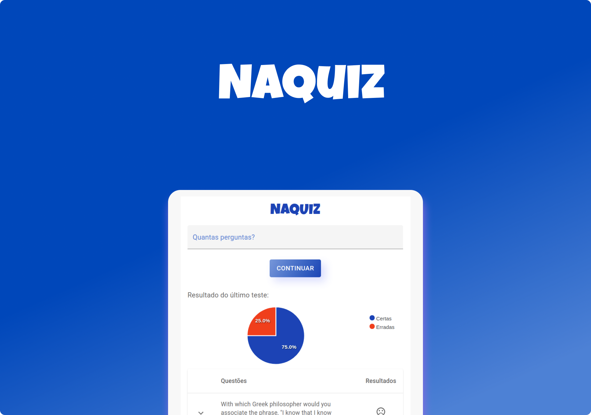

<h1 align="center">
	NaQuiz
</h1>


<p align="center">
	
</p>


O NaQuiz é uma aplicação de quiz, onde foi utilizado a API do [opentdb](https://opentdb.com/) para a busca das perguntas aleatoriamente.

 - **Início**: Usuário escolhe a quantidade de pergunta que deseja responder. Se caso já realizou um quiz, será exibido o resultado do último quiz;
 - **Confirmação**: Essa tela mostra quantas perguntas que o usuário escolhe e se ele quer prosseguir;   
 - **Questões**: Onde de fato será buscado as questões a API e exibido para o usuário;   
 - **Resultado**: Quantidade que o usuário acertou com a quantidade total de questṍes, gráfico com as estatitica de acertos/erros e uma tabela com a questão, resposta escolhida e a resposta certa.

 <h3 align="center">
 <a href="https://naquiz-nextjs.vercel.app/" target="_blank">DEMOSTRAÇÃO DO NAQUIZ</a>
</h3>

## **Configurações Iniciais**

```
  # clonar o repositório
  git clone https://github.com/nivaldoandrade/naquiz-nextjs

  # Instalar as dependências dentro da pasta clonada
  yarn

  # Iniciar a aplicação
  yarn dev

```

## Tecnologias

- ReactJS;
- Next.js;
- Material-ui;
- Typescript;
- Apexcharts;
- Formik;
- Yup;
- Axios;
- Nookies;

### **Um pequeno aprendiz nesse grande mundo da programação.** 😃🗺
